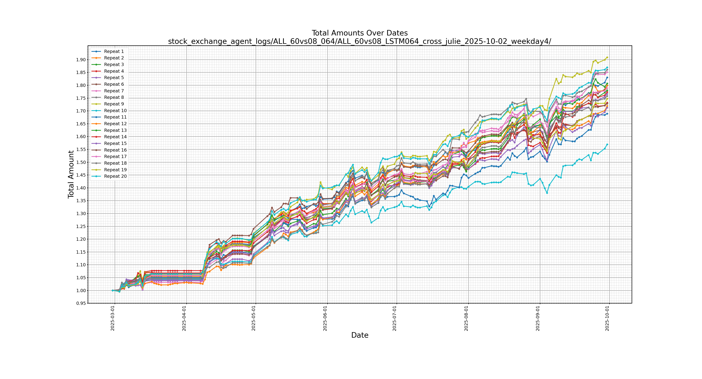
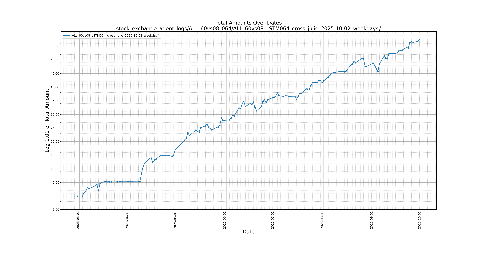

# Julie Stock

## 01 Short introduction

```text
julie_stock/
├── datayes/
│   └── china_daily_order_by_dates/
│       ├── download_ashare_daily_data.py
│       └── download_hk_daily_data.py
├── datayes_data_sample/
├── stock_exchange_agent_configs/
│   └── ALL_60vs08_LSTM064_cross_julie.yaml
├── stock_exchange_agent_logs/
├── train_daily_data/
│   ├── configs/
│   │   └── ALL_60vs08_064/
│   │       └── from_2014/
│   │           ├── ALL_60vs08_LSTM064_crossed_01_14_19.yaml
│   │           ├── ALL_60vs08_LSTM064_crossed_02_15_20.yaml
│   │           ├── ALL_60vs08_LSTM064_crossed_03_16_21.yaml
│   │           ├── ALL_60vs08_LSTM064_crossed_04_17_22.yaml
│   │           └── ALL_60vs08_LSTM064_crossed_05_18_23.yaml
│   ├── checkpoints/
│   ├── logs/
│   ├── models/
│   │   ├── simple_model.py
│   │   ├── lstm_model.py
│   │   └── lstm_autoregressive.py
│   ├── cls_dataset.py (and its dependencies)
│   ├── infer_dataset.py (and its dependencies)
│   └── train.py (and its dependencies)
├── download_ashare_daily_data_endless_run.py
├── download_hk_daily_data_endless_run.py
├── exchange_agent_dynamic_ensemble.py (and its dependencies)
├── exchange_agent_static_ensemble.py (and its dependencies)
├── exchange_agent_single_model.py (and its dependencies)
└── visualize_log.py
```

This is an avocational project providing assistance for my wife's stock investments.
Daily k-line data of China's stock market is purchased and downloaded as a data set for training, validation, and test.

## 02 Data set management

### 02.01 Source of data

The daily k-line data of Chinese stock market is purchased and downloaded from a Chinese financial data provider DataYes.
The data covers historic k-lines of all existed / existing Chinese tickers from as early as 1990 to present.
Scripts inside [datayes/](datayes/) especially in [datayes/china_daily_order_by_dates/](datayes/china_daily_order_by_dates/) download historic data.
While there are also scripts like [download_ashare_daily_data_endless_run.py](download_ashare_daily_data_endless_run.py) and [download_hk_daily_data_endless_run.py](download_hk_daily_data_endless_run.py) for daily accumulative data download.

The opensource version of this project provides one week data sample of A-share k-lines in `datayes_data_sample/`.

- Download daily A-share stock k-line data accumulatively

```sh
python download_ashare_daily_data_endless_run.py --root_dir /dir/where/ashare/data/is/
```

- Download daily HK stock k-line data accumulatively

```sh
python download_hk_daily_data_endless_run --root_dir /dir/where/HK/data/is/
```

### 02.02 Division of the data set


**The data is divided into training-validation part and rolling forward validation-test part. The training-validation part is assigned to multiple cross training-validation sessions. Each cross session has its own validation set.**

### 02.03 The training


- **Cross validation during training**

5 cross training-validation sessions are created here in this example. Each training session is supposed to run 12 epochs (number of epochs is configurable) in each repeat. There will be one checkpoint of model for each epoch, and each checkpoint is validated on the specific validation set assigned to its cross session.
Performance of each checkpoint is recorded into its file name.
Training of time series DL models can easily go overfitting, but we always assume there were an optimal one among the 12 checkpoints in each repeat.

- A model Pool of optimal checkpoints

Each training repeat will save 12 checkpoints and the optimal checkpoint who has the best performance on its cross session's validation set is selected.
Then each training repeat of each session has one optimal checkpoint. If there were 5 cross sessions, and each session has R training repeats, then there will be 5R optimal checkpoints saved.
We sort optimal checkpoints by their performance in each cross session, and select top N models from R optimal checkpoints of each cross session, there would be 5N models selected as a model pool.

### 02.04 Two types of validation set 

There two types of validation set for different stages of model optimization.
Validation sets used during the training are to choose "optimal" checkpoints before training overfitting.
However, the other type of validation sets are used to select an "optimal" ensemble in each round of rolling forward validation and test.

### 02.05 Rolling forward strategy for test

- Validation of models to build an "optimal" ensemble

In each round of rolling forward validation-test, performance of each model in the validation period is evaluated by metrics like daily returns, draw-downs, weekly IR, monthly IR, etc.
K top performance models are chosen from the model pool of 5N models, and then k (k <= K < 5N) models of least covariance between each other are further selected from these K models as an ensemble.
This ensemble is then tested by the "future" data defined by `num_future_days`.
Validation data and future data are not allowed to have intersections to avoid leaking of 'future information'.
In addition, all rolling forward data is isolated from training-validation data by at least 3 months (or even longer).

- The time interval for model ensemble evolution

The time interval between each round of rolling forward validation-test is usually 5 trade days or 20 trade days.
We should redo the validation of models from the model pool to make new ensemble after each time interval.
So that we can always keep the ensemble "fresh" for the next "future" days.
This simulates real world actions that we should periodically update / evolute the ensemble to make it adapted to the lasted stock market situation.


## 03 How can I start a training?

This repository uses cross validation training strategy.
Each cross has its own configuration file.
The following example is to start a training of cross 01 using GPU 0 and GPU 1.
Each GPU will finsh training 50 models.

```sh
python -m train_daily_data.train \
--config train_daily_data/configs/ALL_60vs08_064/from_2014/ALL_60vs08_LSTM064_crossed_01_14_19.yaml \
--num_models 50 \
--gpu_id_list 0,1
```

You can execute this training several times until the number of models in the model pool is enough for ensemble search.
Training is usually time costly, and the length of training time depends on `num_models` and `gpu_id_list` you have configured.


## 04 How can I view models trained?

### 04.01 Naming of model checkpoints

This is an example of model checkpoint.

```sh
model_010_acc_0.1887_0.2070_neg_0.5028_0.6126_pos_0.6339_0.5790_bonus_+0.005486_+0.013263.pth
```

| naming part       | description     |
|-----------------|----------|
| model_                    | header  |
| 010_                      | index of training epoch |
| acc_0.1887_0.2070_        | accuracy on validation set 1 and 2 |
| neg_0.5028_0.6126_        | precisions of negative predictions on validation set 1 and 2 |
| pos_0.6339_0.5790_        | precisions of positive predictions on validation set 1 and 2 |
| bonus_+0.005486_+0.013263 | virtual bonus on validation set 1 and 2 |


### 04.02 Use a command to list trained checkpoints

This command is to view trained models sort by bonus on validation set 1 and validation set 2.

```sh
python -m train_daily_data.model_selection \
--config stock_exchange_agent_configs/ALL_60vs08_LSTM064_cross_julie.yaml \
--checkpoint_dir train_daily_data/checkpoints/ALL_60vs08_064/from_2014/01 \
--n_models_in_each_checkpoint_dir 5 \
--min_bonus 0.00
```

## 05 Run trained models (to run a model pool)

Trained models cannot be used directly for prediction inferences.
We should choose suitable models and utilize them as an ensemble in predictions.
So, the crucial issue is how we select satisfying models from the model pool as an ensemble.
At first, we should run these models one by one on a specific period of data for performance validation.
The following is an example of how we run these models one by one.

```sh
python exchange_agent_run_model_pool.py \
--config stock_exchange_agent_configs/ALL_60vs08_LSTM064_cross_julie.yaml \
--num_repeats 20
```

- Explanation of `num_repeats`:
Repeats could eliminate fluctuation of each model's running results.
From statistics’ point of view, n repeats could make the fluctuation (standard deviation) sqrt(1/n) of the original fluctuation.

Running of a model pool is usually time costly. It may need from at least a few hours to even a few days.
You should configure GPU plan wisely in the yaml file before executing this command.


## 05 Search for ensemble from the model pool

You can search for an ensemble for you using the following command.
This search costs just a few seconds (time may vary on different hardware platforms).
Since it is not a time costly program, this search is usually integrated in `python exchange_agent_static_ensemble.py` and `python exchange_agent_dynamic_ensemble.py`.
You do not have to execute it separately.

```sh
python exchange_agent_ensemble_search.py \
--config stock_exchange_agent_configs/ALL_60vs08_LSTM064_cross_julie.yaml \
--model_pool_log_dir stock_exchange_agent_logs/ALL_60vs08_064/ALL_60vs08_LSTM064_cross_julie_ensemble_search/ \
--top_percentage  0.1 \
--max_ensemble_size 30 \
--last_history_date 2025-02-13
```

- Explanation of `model_pool_log_dir`
This is the location of model pool logs for optimal ensemble search

- Explanation of `top_percentage`: 
We will sort all the models by their training-validation performance on validation set 1 and 2.
`top_percentage` specifies how many models you will roughly grab from the ordered set.

- Explanation of `max_ensemble_size`:
You can continue to choose models from the set grabbed by `top_percentage` using least covariance metric. Models will be sort by covariance, and models of least covariance between each other will be selected.
Covariance is mainly measured by their daily return on the validation set (it is not training-validation set).

- Explanation of `last_history_date`:
The `last_history_date` is the date tells the program the boundary between the validation set and the test set. Future days belong to the test set while other days belong to the validation set. `last_history_date` is the last date in the validation set. The search of ensemble excludes future days (the test set) to avoid validation and search on the test set.


## 06 Test model ensemble(s)

### 06.01 Test a single model

```sh
python exchange_agent_single_model.py \
--config stock_exchange_agent_configs/ALL_60vs08_LSTM064_cross_julie.yaml \
--num_repeats 20 \
--single_model_path train_daily_data/checkpoints/model_005_acc_0.1949_0.2002_neg_0.6434_0.6713_pos_0.5287_0.5278_bonus_+0.010474_+0.016927.pth
```

- Explanation of `num_repeats`:
Repeats could eliminate fluctuation of each model's running results.
From statistics' point of view, n repeats could make the fluctuation (standard deviation) sqrt(1/n) of the original fluctuation.


### 06.02 Test a model ensemble

```sh
python exchange_agent_static_ensemble.py \
--config stock_exchange_agent_configs/ALL_60vs08_LSTM064_cross_julie.yaml \
--num_repeats 20 \
--model_pool_log_dir stock_exchange_agent_logs/ALL_60vs08_064/ALL_60vs08_LSTM064_cross_julie_ensemble_search_0911/ \
--last_history_date 2025-08-22 \
--top_percentage 0.1 \
--max_ensemble_size 50
```

- Explanation of `model_pool_log_dir`
This is the location of model pool logs for optimal ensemble search.

- Explanation of `top_percentage`: 
We will sort all the models by their training-validation performance on validation set 1 and 2.
`top_percentage` specifies how many models you will roughly grab from the ordered set.
This program will use configured value of `top_percentage` in the config file if this argument is not specified.

- Explanation of `max_ensemble_size`:
You can continue to choose models from the set grabbed by `top_percentage` using least covariance metric. Models will be sort by covariance, and models of least covariance between each other will be selected.
Covariance is mainly measured by their daily return on the validation set (it is not training-validation set).
This program will use configured value of `max_ensemble_size` in the config file if this argument is not specified.

- Explanation of `last_history_date`:
`last_history_date` tells the program the boundary between the validation set and the test set. Future days belong to the test set while other days belong to the validation set where `last_history_date` is the last date in the validation set. The selection of ensemble excludes future days (the test set) to avoid "future data leaking" for model validation and searching of "good" models from the model pool.
This program will use configured value of `last_history_date` in the config file if this argument is not specified.

**Exact time range of test set include future days (future days ends with the last day of model pool logs), and extra days after the last day of model pool logs. For example, you have 30 future days after the `last history date` until the last day (2025-09-12) of model pool logs, and today is 2025-09-18, then you will have 30 + 4 = 34 trade days for testing of this ensemble.**


### 06.03 Real prediction for stock exchange

```sh
python exchange_agent_static_ensemble.py \
--config stock_exchange_agent_configs/ALL_60vs08_LSTM064_cross_julie.yaml \
--real_stock_exchange \
--model_pool_log_dir stock_exchange_agent_logs/ALL_60vs08_064/ALL_60vs08_LSTM064_cross_julie_ensemble_search_0911/ \
--top_percentage 0.1 \
--max_ensemble_size 50
```

- Explanation of `real_stock_exchange`:
This argument is specified when real-life stock selling / buying suggestions are needed according to the latest available stock data.

- In this case, `num_future_days` is not specified, which means it is set to the value configured in the config file.
It is recommended that `num_future_days` is set to zero for live predictions.
So that, the lastest ensemble available from model pool logs (In this example, the latest time available for model pool logs is 2025-09-11) is used for prediction.

- You can refer to 06.02 for explanations of `top_percentage` and `max_ensemble_size`.


### 06.04 Test model ensembles dynamically according to time.

In this simulation, the model ensemble is periodically updated according to time and size of `model_interval` specified.


```sh
python exchange_agent_dynamic_ensemble.py \
--config stock_exchange_agent_configs/ALL_60vs08_LSTM064_cross_julie.yaml \
--num_repeats 20 \
--log_dir stock_exchange_agent_logs/ALL_60vs08_064/ALL_60vs08_LSTM064_cross_julie_ensemble_search/ \
--last_history_date 2025-02-13 \
--ensemble_update_interval 5 \
--ensemble_update_weekday 4 \
--top_percentage 0.1 \
--max_ensemble_size 20
```

- Explanation of `model_pool_log_dir`
This is the location of model pool logs for optimal ensemble search.

- Explanation of `last_history_date`:
`last_history_date` here specifies the earliest boundary between the validation set and test set, which also indicates the largest possible length of test set in this simulation.
The length of test set (number of future days) will be subtracted by `ensemble_update_interval` or reduced by `ensemble_update_weekday` periodically during this simulation. 

- Explanation of `ensemble_update_interval`:
`ensemble_update_interval` is the period (number of trade days) between model ensemble updates.
Each time `ensemble_update_interval` trade days are finished in the simulation, number of trade days in test set ("future time") is subtracted by `ensemble_update_interval` so that the simulation can search for a new model ensemble for the latest trade date.
Model ensemble should be periodically updated because data of stock market fluctuates.
Old model ensembles may not suit new stock situations.
This test emulates periodical ensemble updates in real-life stock investments.

- Explanation of `ensemble_update_weekday`:
This is another configuration for periodical ensemble update.
The simulation will update the ensemble on the specified weekday in each week by this argument.
If this argument is sepcified, `ensemble_update_interval` is overwrote.

- For explanations of `top_percentage` and `max_ensemble_size`, you can refer to 06.02 for more information.


## 07 How can I visualize validation / test results?

```sh
python visualize_log.py \
--log_dir stock_exchange_agent_logs/CLS/ALL_60vs08_julie_LSTM064_cross_2025-07-24_18-12-40/ \
--mean \
--logarithm
```

- Explanation of `mean`:
Show equity curve of each repeat if this argument is not specified.
Otherwise, show mean of equity curves of all repeats.

- Explanation of `logarithm`:
Show `value / inital_value` if this argument is not specified.
Otherwise, equity curve would be `log1.01 (value) - log1.01 (initial_value)`.

### 07.01 Visualization of dynamic ensemble test (rolling forward simulation)

#### 07.01.01 **Visualization showing equity curve of all 'repeats'**

**Ys in this chart are arithmetical rates VS the initial value**



#### 07.01.02 **Visualization when `mean` is used**

**Ys in this chart are means of all repeats**


#### 07.01.03 **Visualization when both `mean` and `logarithm` are specified**

**Ys in this chart are log1.01 VS the initial value. Each small grid represents 1% increase or descrease**


